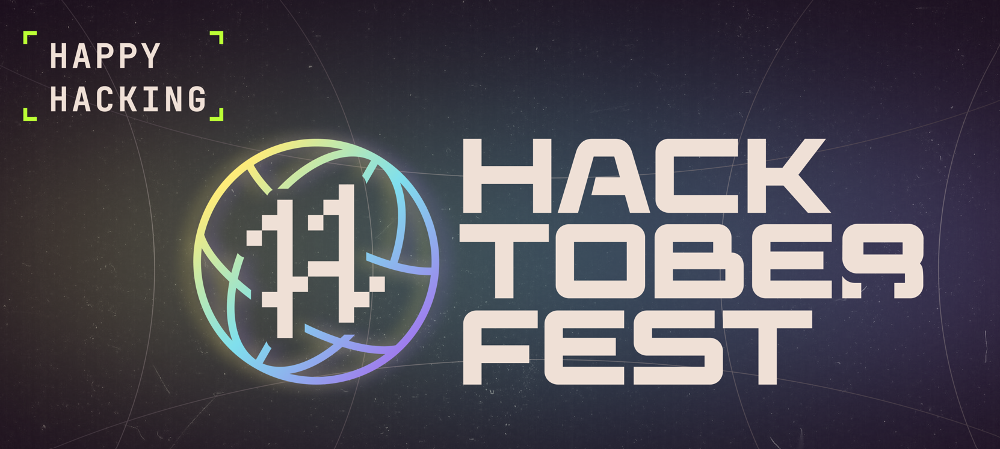

# Welcome to the Hacktoberfest 2023 Repository!



## Introduction
## Guidelines:

- **No DELETING files** 
- Your code doesn't have to be pretty
- You have the freedom to use any programming language.
- If there is no folder for the Programming Language YOU are using, please create a folder inside the **"HacktoberFest"** directory with the name of the language.
- Enjoy the coding process!

Whether you're a developer, student learning to code, event host, or company of any size, you can help drive growth of open source and make positive contributions to an ever-growing community. All backgrounds and skill levels are encouraged to complete the challenge.

## What is Hacktoberfest?

Hacktoberfest encourages participation in giving back to the open-source community by completing pull requests, participating in events, and donating to open source projects. In its 10th year, Hacktoberfest continues to grow and foster a vibrant open source community that we are all a part of.

## How Does It Work?

- First sign up on the Hacktoberfest site anytime between September 26 and October 31.
- To qualify for digital swags, you must register and make four pull requests between October 1-31.
- You can contribute to any public repository on GitHub, not just the ones highlighted.
- If a maintainer reports your pull request as spam or behavior not in line with the project’s code of conduct, you will be ineligible to participate.

## Rules

To earn your tree reward, you must register and make four valid pull requests (PRs) between October 1-31 in any time zone. Pull requests can be made in any participating GitHub-hosted repositories/projects.

## How Can I Contribute?

Contributions aren't limited to code – we welcome contributions to documentation, design, translations, bug reports and more! If you're new to open source or interested in contributing, this repository is a great place to start. If you're an experienced open-source contributor, feel free to check out these issues and contribute.

## Let's Get Started!

Ready to contribute? Check out our Contribution Guide for information on how to get started.

Happy Hacking!

## First Contributions

Welcome to the First Contributions project, designed to help beginners make their first open-source contribution. If you're new to this process, follow the steps below.

_If you're not familiar with the command line, you can use [GUI tools](#tutorials-using-other-tools) to help you._


### Prerequisites

Before you start, ensure you have [Git installed](https://help.github.com/articles/set-up-git/) on your machine.

## Step 1: Fork this repository

Begin by forking this repository. Click the "Fork" button at the top of this page. This action will create a copy of this repository in your GitHub account.

## Step 2: Clone the repository


Next, clone your forked repository to your local machine. Go to your GitHub account, open the forked repository, click on the "Code" button, and then click the "Copy to clipboard" icon.

Open your terminal and run the following command, replacing `"url you just copied"` with the copied URL:

```shell
git clone "url you just copied"
```

For example:

```shell
git clone https://github.com/your-username/first-contributions.git
```

## Step 3: Create a branch

Change to the repository directory on your computer (if you are not already there):

```shell
cd first-contributions
```

Now, create a branch using the `git checkout` command:

```shell
git checkout -b your-new-branch-name
```

For example:

```shell
git checkout -b add-alonzo-church
```

## Step 4: Make necessary changes and commit them

Open the `Contributors.md` file in a text editor and add your name to it. Don't add it at the beginning or end of the file; place it anywhere in between. Save the file.


If you run the `git status` command in your project directory, you'll see there are changes. Add those changes to the branch you created using the `git add` command:

```shell
git add Contributors.md
```

Now commit those changes:

```shell
git commit -m "Add <your-name> to Contributors list"
```

Replace `<your-name>` with your name.

## Step 5: Push your changes to GitHub

Use the `git push` command to push your changes to GitHub:

```shell
git push origin -u <add-your-branch-name>
```

Replace `<add-your-branch-name>` with the name of the branch you created earlier.

<details>

<summary> <strong>If you encounter errors while pushing, click here:</strong> </summary>

- ### Authentication Error

  If you encounter an authentication error, it's because GitHub has removed support for password authentication. You need to use a personal access token instead. [GitHub's tutorial](https://docs.github.com/en/authentication/connecting-to-github-with-ssh/adding-a-new-ssh-key-to-your-github-account) can guide you through generating and configuring an SSH key for your account.

</details>

## Step 6: Submit your changes for review

Go to your repository on GitHub, and you'll see a "Compare & pull request" button. Click on that button.


Submit the pull request.


You will receive a notification email once your changes have been merged.

## What's next?

Congratulations! You've completed the standard _fork -> clone -> edit -> pull request_ workflow for contributing. Celebrate your contribution and share it with friends and followers using the [web app](https://firstcontributions.github.io/#social-share).

If you have questions or need help, you can join our Slack team: [Join Slack Team](https://join.slack.com/t/firstcontributors/shared_invite/zt-vchl8cde-S0KstI_jyCcGEEj7rSTQiA).

Now, let's get you started with contributing to other projects. We've compiled a list of projects with easy issues for newcomers. Check it out [here](https://firstcontributions.github.io/#project-list).


## Merge Policy:
I will merge all pull requests as quickly as possible, as long as they meet the project's requirements and guidelines and are Legit.
<br>
Happy coding!

## Steps to execute Docker Image

```shell
docker build -t my-nginx-hacktoberfest .
```

```shell
docker run -d -p 80:80 my-nginx-hacktoberfest
```

## Dockerized Result


## Project Admin 😎:

<table>
  <tr>
<td align="center"><a href="https://github.com/Midway91"><br /><sub><b>Midway91</b></sub></a></td>
  </tr>
</table>

## Project Contributors ⭐:
<table align="center">
<tr>
<td>
<a href="https://github.com/Midway91/HactoberFest2023/graphs/contributors" align="center">
   
</a>


***
<h2 align="center">
    <p>
        Thank You
    </p>
</h2>